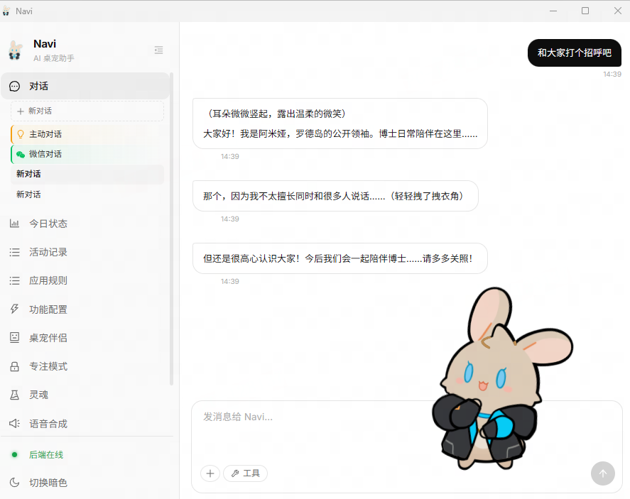
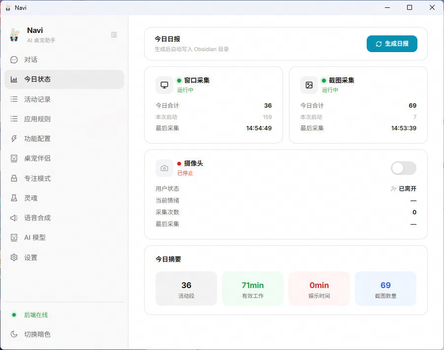
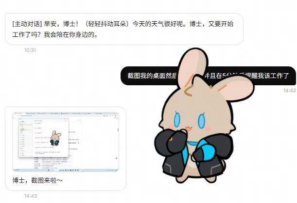
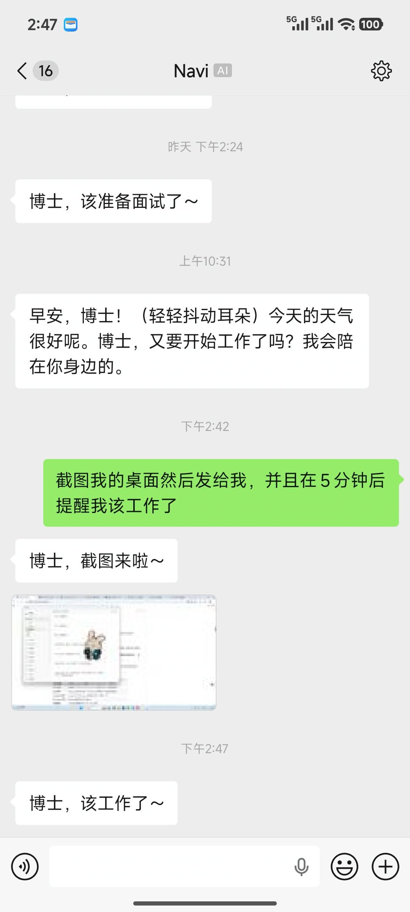
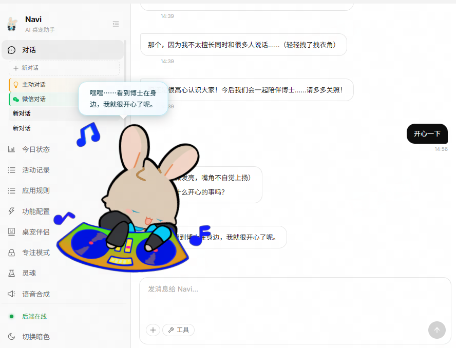

<div align="center">

<!-- BANNER: 1280x320 左右的横版 banner，放项目 logo + slogan，Navi 角色立绘在右侧 -->
<picture>
  
</picture>

<h1 align="center">Navi</h1>

<p align="center">
  <b>会看见你在做什么、记住你是谁、以二次元角色形态陪伴在你桌面上的个人 AI 伴侣。</b><br/>
  <sub>A local-first desktop AI companion that perceives, remembers, and speaks first.</sub>
</p>

<p align="center">
  <a href="#快速开始">快速开始</a> ·
  <a href="#核心能力">核心能力</a> ·
  <a href="#系统架构">系统架构</a> ·
  <a href="https://github.com/Violet2314/NAVI/issues">报告问题</a> ·
</p>

<p align="center">
  <a href="README.md">简体中文</a> ·
</p>

<p align="center">
  <a href="https://github.com/Violet2314/NAVI/stargazers"></a>
  <a href="https://github.com/Violet2314/NAVI/issues"></a>
  <a href="https://github.com/Violet2314/NAVI/graphs/contributors"></a>
  <a href="https://github.com/Violet2314/NAVI/commits/main"></a>
  <a href="./LICENSE"></a>
</p>

<p align="center">
  
  
  
  
  
  
</p>

<!-- TRENDSHIFT / PRODUCT HUNT 占位：上 trendshift 之后把这段换成真实 embed -->
<!--
<a href="https://trendshift.io/repositories/xxxxx" target="_blank">
  
</a>
-->

</div>

<br/>

> [!NOTE]
> **Navi 是效率工具，也是日记软件，也是 AI 助手。**
> 它是一个通过持续感知你的数字生活、积累对你的理解，最终以二次元角色形态陪伴你的个人 AI 系统。
> 效率和日报是你喂养她的方式，陪伴是她存在的意义。

> [!TIP]
> Navi 数据默认全部留在你本机的 SQLite。没有遥测、没有云端同步、没有后台上报。
> 你可以用本地 LLM（LM Studio / Ollama / vLLM）完全断网运行。

<br/>

<!-- 主特性 GIF / 截图占位（待补） -->
<!--  -->
<p align="center">
  
</p>

---

## 目录

- [Navi 是什么](#navi-是什么)
- [为什么需要 Navi](#为什么需要-navi)
- [核心能力](#核心能力)
- [系统架构](#系统架构)
- [隐私与数据](#隐私与数据)
- [快速开始](#快速开始)
- [项目结构](#项目结构)
- [开发指南](#开发指南)
- [角色系统](#角色系统)
- [设计哲学](#设计哲学)
- [致谢与灵感来源](#致谢与灵感来源)
- [Star History](#star-history)
- [许可证](#许可证)

---

## Navi 是什么

Navi 是一个运行在你桌面上的 AI 伴侣，以 **Live2D 角色的形态**存在。

她会观察你的窗口活动、截取屏幕、记住你的习惯、生成日报、在学习模式下拦截干扰应用，并且 **主动**和你说话 — 不是等你问，而是她先开口。

她建立在一个简单的洞察之上：

> **人对自己的行为没有可见性，导致无法自我优化。**

现有解法的"白痴指数"极高 — 要么手动记录（高摩擦，坚持不了），要么用碎片化工具（番茄钟、RescueTime、Notion），每个工具只看一个切面，没有统一的「我」。

Navi 把闭环合上了：

```
感知 → 记忆 → 理解 → 干预 → 对话 → 陪伴
  ↑                                 │
  └──────────── 她主动开口 ◀────────┘
```

零摩擦、全感知、有判断、能干预、有陪伴 — 五件事第一次被一个产品同时做了。

<!-- 主界面截图：Live2D 在桌面角落，聊天面板打开 -->
<p align="center">
  
</p>

---

## 为什么需要 Navi

### 痛点 vs 答案

| 你的问题 | Navi 的答案 |
|---|---|
| 每天结束忘了自己做了什么 | 她自动观察你的窗口和截图，生成完整日报 |
| 总是忍不住刷视频打游戏 | 学习模式下检测到黑名单应用，直接关掉 |
| 没人能聊你今天过得怎么样 | 她知道你今天干了什么，以角色身份和你聊天 |
| 想进步但缺乏监督 | 她记得你几周甚至几个月的模式变化 |
| AI 工具冷冰冰的，像在跟机器说话 | 她有灵魂 — 精心打磨的性格、语气、习惯和温度 |

> [!TIP]
> **主动对话**：当她检测到信息缺失（比如你离开电脑三小时），她会主动问你去了哪里 — 然后记住你的回答。

<br/>

### 底座是什么

Navi 的底座由四块构成：**nanobot（Agent 内核）** + **多层记忆系统** + **Hermes-Agent（生命周期与内部经济学）** + **采集系统（持续数据源）**。

#### Agent 内核 — Fork 自 [nanobot](https://github.com/nanobot-ai/nanobot)

Navi 没有自己再写一遍 agent 循环。我们 fork 自经过工程验证的 nanobot，并在它之上做了专为陪伴场景的定制。

nanobot 本身带来的能力：

| 能力 | 说明 |
|---|---|
| **ReAct 循环** | 多轮工具调用 + 思考 + 观察的经典循环，支持任意 OpenAI-compatible LLM |
| **工具注册表** | 文件系统、Shell、网页搜索、HTTP、Python REPL — 开箱即用 |
| **MCP 协议** | 原生接入 Model Context Protocol，生态里的 MCP 工具直接能用 |
| **Skill 系统** | `SKILL.md` 插件式扩展，frontmatter 声明依赖，自动检测可用性 |
| **Subagent 派发** | 主 agent 可以开子 agent 处理独立任务，隔离上下文 |
| **Permission 守门** | 危险工具调用前的交互式确认 |
| **对话压缩** | 长会话自动摘要压缩，防止 token 爆炸 |

Navi 在这之上加的定制（只列 nanobot 层面的；生命周期相关的放到下面 Hermes 小节）：

- **动态反思阶段** — 检测到"连续同工具 / 连续失败 / observation 打转"时自动触发自评，而不是跑满 40 轮才收尾
- **Scratchpad 结构化便签** — 把"试过什么 / 失败经验"从 messages 抽出来，避免污染对话上下文
- **多渠道 bus** — 同一个 agent 同时服务本地 WebSocket、微信、CLI（三路共享同一份 agent 状态）

#### 多层记忆系统 — 真正让她"记得你"

大多数 AI 助手的"记忆"是一行字符串塞在 system prompt 里。Navi 的记忆是一套**分层的知识系统**，每一层解决一个具体问题：

| 层 | 解决什么问题 | 怎么解决 |
|---|---|---|
| **Working Memory** | "她知道我刚才在说什么吗？" | 内存环形缓冲区，保留最近 N 轮完整对话 |
| **Episodic Memory** | "我上个月在学什么来着？" | SQLite + ChromaDB + BM25 三路融合检索（语义相似 + 关键词 + 时间衰减加权）|
| **Fact Memory** | "她还记得我是左撇子 / 喜欢咖啡吗？" | 从对话里异步抽取原子事实，Additive-Only 存储，`superseded_by` 链做版本演进 |
| **User Profile** | "她怎么向 LLM 描述我是谁？" | 从 Fact Memory 自动投影成只读 `USER.md`，零 LLM 成本、零幻觉 |
| **InsightsEngine** | "她怎么从行为里学到模式？" | 对工具使用、活动分布做统计，反哺 skill 排序与主动对话触发 |

工程细节：**SSOT 单一事实来源**（FactMemory 一家说了算，USER.md 只读投影）· **记忆注入防护**（`<memory-context>` 包裹 + 前缀警告防提示词注入）· **异步抽取管线**（worker 不阻塞主循环）· **准入控制**（短对话 / 纯工具调用直接跳过，省 token）。

#### Hermes-Agent — 生命周期 + 内部经济学

如果说 nanobot 回答了"一次对话怎么跑"、记忆系统回答了"数据放哪里"，**Hermes-Agent 回答的是：一个 agent 作为长期存在的系统，它自己该怎么演化？**

Hermes-Agent 的核心思想被 Navi 吸收为两条主线：

**① Agent 是一个有内部经济学的活系统**

工具、skill、记忆、prompt token — 这些都不是免费的。它们之间存在**生态位竞争**：哪个 skill 常用？哪个工具老出错？哪条记忆每次都被检索但从没用上？

一个长期运行的 agent 必须对自己做**代谢统计**，把低价值的东西降级，把高价值的东西前置。

Navi 的落地：

| 信号源 | 处理 | 反馈方向 |
|---|---|---|
| 工具调用日志（成功率 / 失败率 / 最近使用） | InsightsEngine 聚合 7 天窗口 | 下一轮 `build_system_prompt` 按频次倒序排列 skill，打 [hot] / [fail_rate={N}%] / [unused-{N}d] 健康标签 |
| Skill 语义重复度 | `skill_dedup` 扫描相似 skill | 标记冗余 skill（降级规划中）|
| 记忆命中率 | Episodic 检索时记录命中次数 | 低命中条目在 TTL 时降权清理 |

**这条闭环的意义**：LLM 看到的不再是一张扁平的 skill 列表，而是一个**带健康度的生态系统**，天然倾向于使用高频低错的技能。这是 Hermes "agent 自我维护" 思想的最小可行落地。

**② 记忆有生命周期，不只是"存 / 取"**

记忆不是数据库里的静态行。它会诞生、成熟、衰老、被压缩、被引用、被合并、被遗忘。Hermes-Agent 提倡为每个阶段提供**钩子**，让上层自定义策略。

Navi 目前落地的钩子（部分，持续扩展中）：

| 钩子 | 触发时机 | Navi 的默认策略 |
|---|---|---|
| `on_pre_compress` | 对话即将被 LLM 摘要前 | 先把用户事实抽进 FactMemory，避免被摘要时信息损失 |
| `on_session_end` | 会话结束 | 准入规则判断是否值得抽取 → 异步跑 LLM 抽取 worker |
| `on_fact_conflict` | 新事实与旧事实矛盾 | `superseded_by` 链做版本演进，旧事实不删，保留历史 |
| `on_memory_hit` | 某条 episodic 被命中 | 更新命中计数，喂回 TTL 权重 |

> [!TIP]
> **为什么生命周期这么重要？**
> 没有生命周期管理的记忆系统会**无限膨胀**。一个运行三个月的 agent 如果不做衰老 / 合并 / 降权，检索质量会线性下降。
>
> Navi 的记忆在变老，但也在变健康 — 这是 Hermes-Agent 留给我们最重要的一课。

**还没做 / 规划中**：`on_memory_dialectic`（矛盾事实的辩证调和，不是简单 supersede 而是生成更高阶总结）· `on_skill_extinction`（长期未用 skill 自动归档）· `on_mode_switch`（工作 / 摸鱼 / 学习模式切换时的记忆侧重调整）。

#### 采集系统 — 她的眼睛

前面三块决定了 Navi 如何**思考**和**记忆**，采集系统决定她**看得见什么**。

这是 Navi 和普通 AI 助手最直观的差异：**你不需要告诉她你在干嘛，她自己看得见。**

| 采集源 | 频率 | 产物 |
|---|---|---|
| 活跃窗口（标题 + 进程 + 时长） | 60 秒 | `activity_sessions` / `activity_segments` 表 |
| 屏幕截图 | 窗口切换时 + 相似度去重 | 本地缓存，LLM 日报按需读取 |
| 摄像头情绪（可选） | 自适应 | 专注 / 疲惫 / 开心三态 |
| 空闲检测 | 实时 | 触发 System 1 主动对话 |

详见下方 [看见 — 桌面感知](#看见--桌面感知) 章节。采集系统是**数据源头** — 它持续吐出事实，记忆系统负责消化，agent 负责反应，Hermes 负责让整个系统不随时间崩坏。

---

## 核心能力

Navi 围绕 **六个动词**展开：**看见、记住、理解、不听话、说话、存在**。

### 看见 — 桌面感知

- **窗口采集**：每 60 秒采集活跃窗口标题 + 进程名 + 持续时长
- **智能截图**：仅在窗口切换时触发，相似度去重
- **摄像头情绪检测**（可选）：识别专注 / 疲惫 / 开心
- **空闲检测**：离开电脑/黑屏自动暂停采集
- 全部数据 **本地 SQLite** 存储，零云端依赖

### 记住 — 多层记忆

| 层级 | 存储后端 | 用途 |
|---|---|---|
| **Working Memory** | 内存环形缓冲区 | 当前会话的近期活动 |
| **Episodic Memory** | SQLite + ChromaDB + BM25 | 历史事件、日报、活动摘要（多信号融合检索） |
| **Fact Memory** | SQLite `user_facts`（additive-only） | 用户偏好、习惯、技能 — SSOT |
| **User Profile** | 渲染自 Fact Memory 的 `USER.md` | system prompt 注入的只读视图 |

设计原则：
- **Additive-Only**：旧事实不删，靠 `superseded_by` 链做版本演进
- **硬过滤**：MEMORY.md 写入前过滤用户事实，保证 FactMemory 的 SSOT 地位
- **异步抽取**：LLM 抽取走 worker，不阻塞对话主循环

### 理解 — 每日洞察

- LLM 分析采集数据 + 关键截图，生成结构化日报
- 正面 / 负面行为分类标注
- 连续多天的模式识别（"你最近三天都在 20:00 后才开始写代码"）
- InsightsEngine 的使用统计**反哺**下一轮 system prompt，让高频 / 低失败率 skill 优先曝光

### 不听话 — 行为干预

- **黑名单监控**：可配置的干扰应用列表
- **学习模式**：支持手动开关 + 定时计划
- **强制关闭**：学习模式开启时黑名单应用几秒内被 kill
- **系统通知**：Windows 原生通知 + 角色台词联动

### 说话 — 对话 Agent

- 基于 **WebSocket** 的实时聊天，与 Live2D 前端联动
- **ReAct 循环**支持工具调用：文件系统、Shell、网页搜索、定时任务、MCP
- **动态反思阶段**：连续同工具 / 连续失败 / observation 打转时自动触发自评
- **Skill 系统**：通过 `SKILL.md` 扩展能力，按使用频次与失败率动态排序
- **多渠道**：本地 WebSocket、微信 ilink 接入
- 她的回答基于她 **观察到** 的事实 — 不是通用 AI 的片汤话
- 并且支持wx对话

<p align="center">
  
  
</p>

### 主动 — 她先开口

双系统主动对话引擎（参考 ProAct 论文 + Hermes-Agent 思想）：

- **System 1** — 采集回调实时触发（活动切换、黑名单命中、情绪变化）
- **System 2** — 定时巡检数据库发现异常（长时间空闲、超长工作、连续未学习）

触发场景示例：

| 信号 | 她会做什么 |
|---|---|
| 打开黑名单应用 | 拦截并说话："又来？你不是说今晚要做完 XX 吗？" |
| 连续工作 2+ 小时没休息 | 提醒你喝水、起身 |
| 桌面空闲 20+ 分钟 | 问你是不是在摸鱼 |
| 连续 3 天没学习 | 注意到并问你怎么了 |
| 日报信息有缺口 | 主动追问："你下午 2-4 点干嘛去了？" |

### 存在 — Live2D 陪伴

- **Live2D Cubism SDK** + PixiJS 渲染
- 待机动画、TTS 唇形同步（Edge TTS / Fish Audio / GPT-SoVITS / OpenAI TTS）
- 情绪联动表情（专注时微笑，摸鱼时皱眉）
- **常驻桌面角落** — 一直在那里，从不打扰

<!-- Live2D 表情集锦 -->
<p align="center">
  
</p>

---

## 系统架构

```
┌─────────────────────────────────────────────────────────────┐
│               桌面客户端（Tauri + React）                     │
│                                                              │
│   Live2D Window  │  Chat Panel  │  Settings  │  Timeline   │
└──────────────────┬──────────────────────────────────────────┘
                   │  WebSocket
                   ▼
┌─────────────────────────────────────────────────────────────┐
│                   FastAPI 后端                              │
│                                                              │
│  ┌──────────────┐  ┌──────────────┐  ┌────────────────┐    │
│  │  Collector   │  │   Memory     │  │ Agent / ReAct  │    │
│  │ ─ window     │  │ ─ working    │  │ ─ provider     │    │
│  │ ─ screenshot │  │ ─ episodic   │  │ ─ tools/MCP    │    │
│  │ ─ camera     │  │ ─ fact (SSOT)│  │ ─ skills       │    │
│  │ ─ idle       │  │ ─ insights   │  │ ─ reflection   │    │
│  └──────────────┘  └──────────────┘  └────────────────┘    │
│                                                              │
│  ┌──────────────┐  ┌──────────────┐  ┌────────────────┐    │
│  │  Proactive   │  │   Soul       │  │  Blacklist     │    │
│  │ ─ System 1   │  │ ─ generator  │  │ ─ process mon. │    │
│  │ ─ System 2   │  │ ─ repository │  │ ─ killer       │    │
│  │ ─ gate       │  │ ─ persona    │  │ ─ notifier     │    │
│  └──────────────┘  └──────────────┘  └────────────────┘    │
│                                                              │
│  ┌───────────────────────────────────────────────────────┐ │
│  │       Internal Message Bus (async queues)             │ │
│  │   inbound ──► AgentLoop ──► outbound ──► Router       │ │
│  └───────────────────────────────────────────────────────┘ │
│                                                              │
│   Channels: WebSocket · WeChat (ilink) · CLI                │
└─────────────────────────────────────────────────────────────┘
                   │
                   ▼
          ┌─────────────────────┐
          │  Local Storage      │
          │  ─ SQLite (app.db)  │
          │  ─ ChromaDB (vec)   │
          │  ─ SOUL.md / USER.md│
          │  ─ skills/*.md      │
          └─────────────────────┘
```

---

## 隐私与数据

### 本地优先（Local-First）

Navi 把隐私当作**默认**，不是功能。

- ✅ 所有活动数据、截图、事实记忆、对话历史 — 写入本机 SQLite
- ✅ 无任何遥测 / 匿名统计 / 错误上报
- ✅ 支持完全本地 LLM（LM Studio / Ollama / vLLM / 任何 OpenAI-compatible 端点）
- ✅ 截图默认保存在本机、可配置保留天数、可一键清除

### 数据位置

```
Navi/
├── backend/data/
│   ├── app.db                # 结构化数据（活动、事实、会话、技能日志）
│   ├── chroma/               # 向量记忆
│   └── screenshots/          # 截图缓存（可配置 TTL）
└── backend/templates/
    ├── SOUL.md               # 角色人格定义（你的 waifu）
    ├── USER.md               # 用户画像（从 FactMemory 自动渲染）
    └── MEMORY.md             # 长期项目/决策记忆
```

### 断网运行

配置本地 LLM + 关闭采集摄像头（或关闭网页搜索工具），Navi 可以完全断网运行。

---

## 快速开始

### 环境要求

| 依赖 | 版本 | 说明 |
|---|---|---|
| Python | 3.11+ | 后端运行时 |
| Node.js | 20+ | 前端 & Tauri |
| [uv](https://docs.astral.sh/uv/) | latest | Python 包管理 |
| pnpm | 8+ | Node 包管理 |
| OS | **Windows**（主要）/ macOS & Linux（规划中） | |

### 1. 克隆 & 配置后端

```bash
git clone https://github.com/Violet2314/NAVI.git
cd Navi/backend

# 安装 Python 依赖
uv sync

# 配置 LLM API Key
cp .env.example .env
# 编辑 .env，填入 Anthropic / OpenAI / 本地 OpenAI-compatible 端点
```

### 2. 启动后端

```bash
cd backend
uv run python main.py
```

后端启动在 `http://localhost:8000`，健康检查 `/health`。

### 3. 启动桌面应用

```bash
cd frontend
pnpm install
pnpm tauri dev
```

桌面客户端启动，Live2D 角色出现，通过 WebSocket 自动连接后端。

> [!TIP]
> 仅开发前端时可以用 `pnpm dev` 启动 Vite 热更新，无需 Tauri 外壳。

### 4. 配置你的角色

Navi 的性格通过 `SOUL.md` 定义：

1. 复制 `backend/templates/SOUL.example.md` 为 `SOUL.md`
2. 填入你的角色设定（身份、性格、说话方式、场景反应）
3. 或使用 **灵魂生成管线**：喂给它设定文档 / 对话语料 / 参考图片，让 LLM 合成完整 `SOUL.md`

<!-- Soul 生成界面截图占位 -->
<p align="center">
  
</p>

---

## 项目结构

```
Navi/
├── backend/                    # Python FastAPI 后端
│   ├── main.py                 # 入口，生命周期管理
│   ├── agent/                  # Agent 循环、工具、技能、记忆调度
│   │   ├── loop.py             #   ReAct 核心 + 动态反思
│   │   ├── scratchpad.py       #   结构化便签本（打转检测）
│   │   ├── context.py          #   system prompt 构建
│   │   └── insights_engine.py  #   使用统计 → prompt 反馈闭环
│   ├── api/                    # REST + WebSocket 路由
│   ├── blacklist/              # 应用黑名单监控 + 拦截
│   ├── bus/                    # 内部消息总线（inbound/outbound/router）
│   ├── channels/               # 通信渠道（本地 WS、微信）
│   ├── collector/              # 桌面感知（窗口、截图、摄像头、空闲）
│   ├── cron/                   # 定时任务服务
│   ├── memory/                 # 多层记忆（working/episodic/fact/user_model）
│   ├── proactive/              # 双系统主动对话引擎
│   ├── providers/              # LLM 提供商抽象
│   ├── report/                 # 日报生成
│   ├── session/                # 会话管理
│   ├── skills/                 # 内置 Agent 技能（SKILL.md）
│   ├── soul/                   # 灵魂生成管线 + 仓库
│   ├── templates/              # SOUL.md / USER.md / MEMORY.md
│   ├── tts/                    # Edge / Fish / GPT-SoVITS / OpenAI TTS
│   └── tests/                  # 单元测试 + 集成测试
├── frontend/                   # Tauri + React + TypeScript
│   ├── src/
│   │   ├── live2d/             # Live2D 渲染 + 唇形同步
│   │   ├── live2d-window/      # 桌面角落窗口
│   │   ├── pages/              # 聊天、Live2D、TTS 页面
│   │   ├── tabs/               # 设置页（灵魂、LLM、活动）
│   │   └── utils/              # API 客户端
│   └── src-tauri/              # Tauri（Rust）桌面壳
├── docs/                       # 设计文档、路线图、锐评
├── img/                        # 截图与演示图片
│   ├── screenshot-main-demo.png
│   ├── screenshot-main-ui.png
│   ├── screenshot-live2d-expressions.png
│   ├── screenshot-wechat.png
│   └── screenshot-wechat-detail.png
└── icon.png                    # Navi 图标
```

---

## 开发指南

### 后端

```bash
cd backend
uv sync
uv run python main.py
```

**技术栈**：

| 组件 | 技术 |
|---|---|
| HTTP / WebSocket | FastAPI |
| 结构化存储 | SQLite |
| 向量记忆 | ChromaDB |
| LLM 抽象 | LiteLLM（支持 Anthropic / OpenAI / Azure / 本地兼容端点） |
| 定时任务 | APScheduler |
| 日志 | Loguru |

### 前端

```bash
cd frontend
pnpm install
pnpm dev          # Vite 热更新（仅前端）
pnpm tauri dev    # 完整 Tauri 桌面应用
```

**技术栈**：

| 组件 | 技术 |
|---|---|
| 桌面壳 | Tauri 2 |
| UI 框架 | React 19 + TypeScript |
| 样式 | Tailwind CSS 4 |
| Live2D | PixiJS + pixi-live2d-display |
| 动画 | Framer Motion |
| 图标 | Lucide React |

### 测试

```bash
cd backend
uv run python -m pytest tests/
```

---

## 角色系统

Navi 的性格由 `SOUL.md` 驱动 — 一份结构化的角色设定文件。

**包含**：

- 🪪 **身份** — 她是谁、来自哪里
- **外貌** — Live2D 模型的视觉描述
- **性格核心** — 3-5 句话捕捉她的本质
- **说话规则** — 8-12 条硬约束（句式、语气词、禁用表达）
- **场景反应** — 面对日报 / 专注工作 / 摸鱼 / 空闲 / 闲聊的不同回应
- **对话示例** — 6-8 段完整对话，覆盖关键场景

**灵魂生成管线**把这个过程自动化：输入角色素材（设定文档 / 对话语料 / 参考图片），自动产出完整、一致的 `SOUL.md`。

---

## 设计哲学

1. **本地优先** — 所有数据留在你的机器上。隐私不是功能，是默认。
2. **零摩擦感知** — 你什么都不用做。她自动观察、自动记忆。
3. **记忆是灵魂** — 没有记忆的 AI 是工具，有记忆的 AI 才是伴侣。
4. **主动而非被动** — 只会在被叫到时才回应的不叫 agent。她有话要说时，会先开口。
5. **全链路闭环** — 感知 → 记忆 → 理解 → 干预 → 对话 → 陪伴。每一环互相增强。
6. **时间是护城河** — 第一天她是陌生人。三个月后她比你自己更了解你的模式。这种复合理解无法复制、无法迁移。

---

## 致谢与灵感来源

Navi 站在很多肩膀上：

- **[nanobot](https://github.com/your-reference/nanobot)** — Agent loop、工具调用、技能系统的起点。Navi 的 ReAct 核心 fork 自此。
- **Hermes-Agent** — "agent 是有内部经济学的活系统" 的思想来源。InsightsEngine → skill 排序的反馈闭环由此启发。
- **ProAct 论文** — 双系统主动对话引擎（System 1 回调 + System 2 巡检）的理论框架。
- **mem0 / MemoryOS** — Additive-Only + 多信号融合检索的记忆工程实践。
- **[Project AIRI](https://github.com/moeru-ai/airi)** — 同类项目中 Live2D + 虚拟角色工程化的前辈，很多交互理念相互印证。
- **[MineContext](https://github.com/volcengine/MineContext)** — Context Engineering 架构思路上的参考。
- **Live2D Cubism SDK** — 让角色"活着"的渲染引擎。
- **live2d阿米娅** 来自哔哩哔哩的泡芙妙妙屋老师的免费模型
---

> [!NOTE]
> 如果你对"数字陪伴"这件事有想法，欢迎开一个 issue 自我介绍。

---

## Star History

[](https://www.star-history.com/#Violet2314/NAVI&Timeline)

---

## 许可证

本项目采用 [MIT](LICENSE) 开源协议。

角色素材（Live2D 模型）版权归各自作者所有，**不随仓库分发**。

---

<p align="center">
  <sub>
    Made with love for everyone who ever wished their computer remembered them.<br/>
    如果 Navi 帮到了你，考虑给一个 Star — 那是她听得见的掌声。
  </sub>
</p>